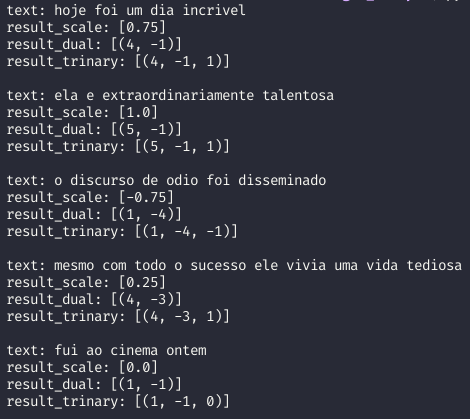

<h1 align="center"> Análise de sentimentos com SentiStrength </h1>

<p align="center">
  

  
  
  <a href="https://github.com/LucasPereiraMiranda/sentiment-detection-with-sentistrength/commits/master">
    
  </a>

  <a href="https://github.com/LucasPereiraMiranda/sentiment-detection-with-sentistrength/issues-pr/">
    
  </a>

  <a href="https://github.com/LucasPereiraMiranda/sentiment-detection-with-sentistrength/issues">
    
  </a>
</p>

<p align="justify"> Repositório para estudar e usar o algoritmo Sentistrength para análise de sentimentos no contexto do português do Brasil. 
</p>

## Techs

A análise está sendo realizada com as seguintes tecnologias:

- [Python 3](https://www.python.org/)
- [SentiStrength](http://sentistrength.wlv.ac.uk/)

## O que é o Sentistrength?

O Sentistrength é um algoritmo de análise de sentimentos interessante para textos de redes sociais (geralmente curtos e carregados com sentimentos).
Ele utiliza um dicionário léxico anotado por seres humanos e melhorado com o uso de Aprendizado de Máquina. O SentiStrength atribui pontuações
a tokens de um dicionário, sendo que as palavras com emoções positivas são atribuídos valores entre 1 e 5 e as palavras com emoções negativas são
atribuídos valores entre -5 e -1. Os valores 1 e -1 são usados para indicar emoções neutras, enquanto que 5 e -5 são usados para indicar emoções
muito positivas e muito negativas, respectivamente. E realizado um cálculo com a polaridade de cada termo com emoção na frase, resultando em scores
que indicam o resultado da análise de sentimento.

O sentistrength 0.0.7 oferece alguns scores resultantes da análise de sentimentos de um texto, dentre os principais temos:

- dual
- trinary
- scale

Exemplo:

    texto de entrada: 'mesmo com todo o sucesso ela vivia uma vida tediosa'

Scores resultantes:

    dual: [(positivo,negativo)] [(4,-3)] positivo em 4 e negativo em -3
    trinary: [(positivo,negativo,neutro)] [(4,-3,1)]  positivo em 4, negativo em -3 e neutro em 1
    scale: [0.25] escala proporcional ao dual e ao trinary, variando entre 1 (muito positivo) e -1 (muito negativo). O valor 0 representa o neutro.

## Como fazer a análise?

Podemos instalar as dependências necessárias no seu ambiente python3 (ou virtualenv)

- requiriments.txt possui as dependências básicas necessárias para o projeto

```shell
  pip3 install -r requirements.txt
```

- Podemos executar o seguinte comando para rodar a análise (após setar os paths no script /source/sentistrength_test.py):

```shell
  python3 source/sentistrength_test.py
```

## Como podemos criar um ambiente virtual (virtualenv) para o projeto? (opcional)

- Com o python3 já instalado no computador, podemos executar:

```shell
  pip3 install virtualenv
```

- Podemos gerar um novo ambiente virtual executando o comando:

```shell
  virtualenv venv # venv é o nome do seu ambiente virtual isolado
```

- Podemos ativar o ambiente virtual executando:

```shell
  source /venv/bin/activate # Linux ou Mac
```

```powershell
  venv\Scripts\activate # Windows
```

- É possível instalar as dependências no novo ambiente virtual executando:

```shell
  pip3 install -r requirements.txt
```

## Resultados dos testes de análise de sentimentos

<div display="flex" align-items="center" justify-content="center">
  
</div>


## Referências

- [SentiStrength.uk](http://sentistrength.wlv.ac.uk/)